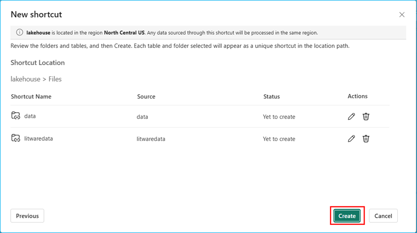
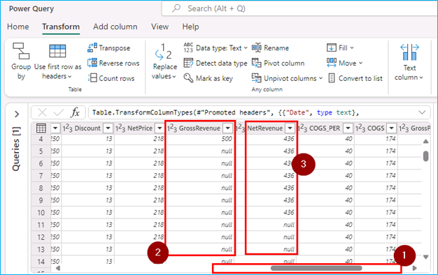

### Exercise 1: Data Engineering/Data Factory experience - Data ingestion from a spectrum of analytical data sources into OneLake

*Before we start executing the steps, we will open a backup Click-by-Click lab using the following hyperlink in a new tab and navigate back to the VM browser:* 
[Click-by-Click](https://regale.cloud/Microsoft/viewer/3088/modern-analytics-with-microsoft-fabric-copilot-and-azure-databricks-dream-lab-fu/index.html#/0/0) 

   *Now, let's trigger the Simulator App to start streaming data to EventHub (**to be used later in exercise 4**).*

1. Open a **Microsoft Edge browser** from VM desktop.

2. Click on browser address bar and click **<inject key= "WebAppBrowse" enableCopy="true"/>** to browse app service and press **Enter**.

  >**Note**: **Do not click anywhere else on the screen until all of the text has been auto-filled.**

3.**IMPORTANT!!** PROCEED WITH THE NEXT STEPS WHILE THIS LOADS.


  


### Task 1.1: Create a Microsoft Fabric enabled workspace


In this exercise, you will act as the Data Engineer, Eva, to transfer Contoso's data from Azure SQL Database into the Lakehouse and initiate data preparation for the upcoming merger between Contoso and Litware Inc.

1. Open **Microsoft Fabric** in a new tab by copy pasting the below link.

   ```BASH
   https://app.fabric.microsoft.com/home
   ```

2. Sign in with your Azure AD credentials. If you are not already signed in, you will be redirected to the Microsoft Fabric login page.

>**Note:** Close any pop-up that appears on the screen.

.png)

3. From the left navigation pane, click on **Workspaces** and then the **+ New workspace** button.


4. Type the name **<inject key= "WorkspaceName" enableCopy="true"/>**, **validate** the availability of the name, and click on **Advanced**.

>**Note:** Only use the workspace name provided above.

>**NOTE:** If the name **<inject key= "WorkspaceName" enableCopy="false"/>** is already taken, refresh the page and check again. A workspace with that name may already be created. If so, add a different suffix until the name is available.


5. Ensure **Fabric capacity** is enabled, verify that **fabric...- North Central US** is selected under **Capacity**, and then click **Apply**.


>**Note:** Close any pop-up that appears on the screen.


>**Note:** Wait for the Power BI Workspace to load.


### Create/Build a Lakehouse

Now, let's see how each department can easily create a Lakehouse in the Contoso workspace without any provision. They simply provide a name, given the proper access rights of course!

>**Note:** Verify that you are in the **<inject key= "WorkspaceName" enableCopy="false"/>** **Workspace** created in the earlier steps.

1. Click on **+ New item** button.
   


2. In the pop-up window search for **Lakehouse** in the search bar and click on **Lakehouse**.


3. Copy the name **lakehouse** from the following and paste it in the **Name** field.

```BASH
lakehouse
```
4. Click on the **Lakehouse schemas** checkbox and then click on the **Create** button.


In just a few seconds, the Lakehouse is ready. With the right access, you, as a Data Engineer, can effortlessly create a new Lakehouse. There is no need to set up any storage accounts or worry about network, infrastructure, key vault, Azure subscriptions, etc.


---

### Task 1.2: Use the New Shortcut option from external data sources

Now, this is something exciting! This section shows how easy it is to create Shortcuts without moving data. That is the power of OneLake! In this exercise, you will ingest the curated bounce rate data for Litware from ADLS Gen2 using the New Shortcut option. Let’s see how!

1. Click on the **three dots (ellipses)** on the right side of Files.

2. Click on **New shortcut**.

>**Note:** Make sure you create a shortcut under **Files** and not under **Tables** in the lakehouse explorer pane.


3. In the pop-up window, under **External sources**, select the **Azure Data Lake Storage Gen2** source.


>**Note:** Wait for the screen to load.

4. Select **Create new Connection** radio button.

5. In the following screen, we need to enter the connection details for the ADLS Gen2 shortcut.


6. Copy the **Data Lake Storage endpoint**: **<inject key= "storageEndpoint" enableCopy="true"/>** and paste it into the **URL** field.

7. Select **Organization account** in the **Authentication Kind**, and ensure you are signed in and click on **Next**.


8. Select the **data** and **litwaredata** checkbox and then Click on the **Next** button.


9. Click on the **Create** button.



10. And there you go! Your shortcut is now ready! We can see the newly created shortcut named **litwaredata** and **data**.


Prior to Microsoft Fabric, departments in Contoso had to move the data they needed from other departments via time-consuming ETL processes. But look, now they have created shortcuts. No need to move any of this data. That is the power of OneLake!

### Task 1.3: Create Delta tables using Spark Notebook

Now, let’s see how Data Engineer, Eva, got the remaining data into OneLake by creating Delta tables using Spark Notebook. By using a Spark Notebook to create Delta tables, Eva can ensure more reliable, scalable, and efficient data management, which is essential for handling big data workflows.

1. Click on Workspace **<inject key= "WorkspaceName" enableCopy="false"/>** and select **New item**.


2. In the **New Item** tab, scroll down and click on **Notebook**


>**Note:**  If the **Pop-up** appears click on **Skip tour**
 


3. Click on the **Add data items** button and then select **Existing data sources** from the dropdown.


4. Select the **lakehouse** and then click on **Connect** button.


5. Once the notebook is created, paste the **below code** in the existing cell and run the cell by clicking on the **Run cell** icon.

```BASH
import os
import pandas as pd
 
# List all CSV files in the 'litwaredata' folder
file_path = '/lakehouse/default/Files/litwaredata/'
csv_files = [file for file in os.listdir(file_path) if file.endswith('.csv')]
 
# Load each CSV file into a table
for file in csv_files:
    table_name = file.split('.')[0]
    df = pd.read_csv(file_path + file)
    spark.createDataFrame(df).write.mode("ignore").format("delta").saveAsTable(table_name)
```


>**Note:** Please wait for the session to start and execute the cell.

6. Once the **execution is successful** you'll see a **Green tick** appears at the bottom of cell.
7. Click on the Stop icon in the ribbon at the top to **Stop the Spark session**.
8. Click on **Lakehouse** in the left navigation bar.


9. Expand **Tables** and expand **dbo** under Tables. Click on the **three dots** (Ellipses) next to dbo and click **Refresh** from dropdown options.


10. View the successfully **loaded tables**.


11. Click on **website_bounce_rate** delta table and view the website bounce rate data.


You now have all the table in **OneLake** for Contoso to leverage. Next, we proceed with data transformation using Dataflow Gen2 to transform the sales data ingested from Litware. 


### Task 1.4: Leverage Dataflow Gen2 and Data pipelines for a "No Code-Low Code" experience to quickly ingest data with Fast Copy and transform it using Copilot

Using another great feature in Fabric’s Data Factory, called Fast Copy, Contoso’s Data Engineer, Eva, quickly ingests terabytes of data with dataflows, thanks to the scalable Copy Activity in the pipeline. With so much data from Litware, there is bound to be a lot of clean up needed. Let’s step into Eva’s shoes to explore how she used fast copy to ingest data and Copilot to transform it, just in time to derive meaningful customer insights before their big Thanksgiving Sale!

You will experience how easy it is to use Fast Copy to transform Litware's sales data into the Lakehouse.

1. In the left pane, click on the **<inject key="WorkspaceName" enableCopy="false"/>** workspace, then select **New item**, and click on **Dataflow Gen2**.


2. Click on the **Get data** icon (**not on the dropdown arrow at the bottom of the icon**).


3. In the pop-up window, scroll down to **Onelake catalog** and click on **lakehouse**.


5. Expand **lakehouse**, expand **Files** and expand **data** then scroll down.


6. Scroll down and select the **sales_data.csv** checkbox, then **click** on the **Create** button.


7. Collapse the **Queries** pane and take a look at the sales dataset, the first row needs to be identified as a header (**note that the first row of this dataset is not a header**).


**Let's use Copilot to perform data cleansing.**

8. Click on the **Copilot** button, paste the **prompt** provided below in the following text box and click on the **send** icon.

>**Note:** If the copilot icon is not visible, click on the **>** under the Home ribbon to move the items. 

```BASH
In the table sales_data csv, apply first row as headers.
```


>**Note:** If Copilot needs additional context to understand your query, consider rephrasing the prompt to include more details.

9. Scroll to the right-hand side and observe the **GrossRevenue** and **NetRevenue** columns. You'll notice the there are some empty rows with null values.



>**Let's use Copilot to remove empty rows.**

10. Similarly, paste the prompt below in Copilot and click on the **send** icon.

```BASH
Remove empty rows from GrossRevenue and NetRevenue columns.
```


11. Scroll to the right hand side and observe the **GrossRevenue** and **NetRevenue** columns (**there are no empty rows with null values**).


>**Note:** Expand the queries pane collapsed earlier.

12. Right-click on the query **sales_data.csv**, and select **Require Fast Copy**.

  

**Fast copy** enhances the data handling capabilities within Fabric, making **data transfers** faster and more seamless across the platform.

>**Note:** Due to time constraints, we will not publish and run the Dataflow from the Pipeline.

13. Click on the **close** icon at top right of the **Dataflow** window.

>**Note:** If necessary, scroll up to show the close icon.

 

14. Click on **Yes.**


Congrats on completing this data transformation exercise!

