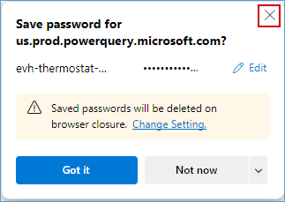
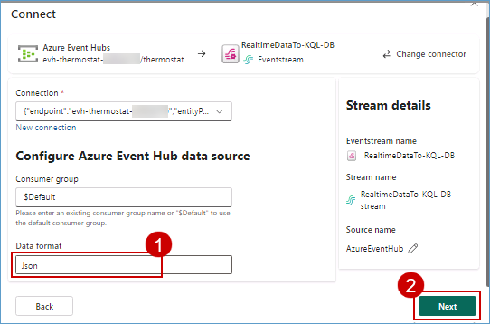

### Exercise 4: Real-time Intelligence experience: Explore Streaming data using Copilot for KQL DB (Optional)

Imagine, it is 6 am on the day of Contoso's big Thanksgiving sale. Customers are flocking to their stores in large numbers. We are about to witness the very culmination of Contoso's phenomenal transformation with Microsoft Fabric and Azure Databricks. Specifically, we will see how near real-time data is used to make decisions for the next moment in Contoso's stores to ensure optimal temperatures are maintained for their customers while they shop at the big sale!

### Task 4.1: Ingest real-time data into Eventhouse using Eventstream

In the exercise, we’ll explore how Data Engineer, Eva, ingested real-time data from the event hub into the KQL Database to monitor in-store temperatures in real time.

1. Select **<inject key= "WorkspaceName" enableCopy="true"/>** workspace from the left navigation pane, click on **+New item**, then scroll down to the **Store data** section, and click on **Eventhouse**.

    

    >**Note:** If you see a pop-up like the following one, click on the **Don't save** button.

      

2. In the **Eventhouse name** field enter **Contoso-Eventhouse**.

    ```
    Contoso-Eventhouse
    ```

3. Click on the **Create** button and wait for the database to be created.

    

    >**Note:** If you see a **pop-up** like the one in the screenshot below, ignore it and proceed with the next step.

    

4. Select **<inject key= "WorkspaceName" enableCopy="true"/>** workspace from the left navigation pane, click on **+New item**, then scroll down to the **Prepare data** section, and click on **Eventstream**.

    

    >**Note :** If you have 10 items in the left navigation, you won't be able to create an Eventstream. Remove any unnecessary items and then proceed to create the Eventstream.

5. Enter the name as **RealtimeDataTo-KQL-DB** and click on **Create** button.

    ```
    RealtimeDataTo-KQL-DB
    ```

    

6. Click on **Connect data sources**. 

    

7. Click on the **Connect** button for **Azure Event Hubs**.

    

8. Under the Connection field, click on **New connection**.

    

9. Enter the value for the **Event Hub namespace** as **<inject key= "eventhubNamespace" enableCopy="true"/>** and enter the **Event Hub** value as **thermostat**.

    ```BASH
    thermostat
    ```
    

10. Scroll down and select **Shared Access Key** from Authentication kind dropdown, enter the Shared Access Key Name as **thermostat**.

    ```BASH
    thermostat
    ```
11. Provide the **Shared access Key** as: **<inject key= "EventHubPolicyPrimaryKey" enableCopy="true"/>** and click on **Connect** button.

    >**Note:** Do not check in box to allow connection to be utilized with either on-premises or VNet data gateways if appears.

    

    >**Note:** Close any pop-up which appears on screen.

    

12. Select Data format as **JSON** and click on **Next** button.

    

    >**Note:** Wait for the connection to be established.

13. Click on the **Add** button.

    

14. In the Eventstream canvas, click on the **Add destination** dropdown and select **Eventhouse**.

    

15. Select the **Event processing before ingestion** radio button, in the **Destination name** field enter **RealTimeData**.

    ```
    RealTimeData
    ```

16. In the **Workspace** field select <inject key="WorkspaceName" enableCopy="true"/>. 

17. In the **Eventhouse** dropdown select **Contoso-Eventhouse**.

18. In the **KQL Database** dropdown select **Contoso-Eventhouse**.

19. In the **KQL Destination table** field, click on **Create new** button..

    

20. Enter the table name as **thermostat** and then click on the **Done** button.

    ```
    thermostat
    ```
    

21. In the **Input data format** dropdown select **Json** and click on the **Save** button.

    >**Note:** Zoom-out on your screen if the **Input data format field** is not visible.

    

22. Drag Arrow from **RealtimeDataTo-KQL** and connect it to **RealTimeData**.

    

23. Click on the **Publish** button.

    

    >**Note:** Wait for the data ingestion from EventHub to KQL DB, In the RealTimeData canvas, the status will appear as **Active**, confirming that the streaming has started successfully.

24. Once you see that the streaming has started, click on **Refresh** and wait for the data to preview.

    

Real-time data from the event hub has been ingested successfully into the KQL Database. Next, as customers walk in aisles and the temperatures fluctuate, let us see how KQL queries proactively identify anomalies and help maintain an optimal shopping experience!

---

### Task 4.2: Analyze and discover patterns, identify anomalies and outliers using Copilot

Kusto Query Language is a powerful tool. In this scenario KQL is used to explore Contoso’s data, discover patterns, identify anomalies and outliers, create statistical modeling, and more.

We use KQL to query the thermostat data that’s streaming in near real-time from the devices installed in Contoso’s stores.

1. Select **<inject key= "WorkspaceName" enableCopy="true"/>** workspace from the left navigation pane, click on **+New item**, then scroll down to the **Track data** section, and click on **KQLQueryset**.

    


2. In the **KQL Queryset name** field, copy-paste the following, "Query Thermostat Data in Near Real-time using KQL Script" and then click on the **Create** button.

    ```
    Query Thermostat Data in Near Real-time using KQL Script
    ```

    

3. **Wait** for the query set creation and a new screen will display. In this screen, click on **Contoso-Eventhouse**, verify the workspace name and then click on the **Connect** button.

    

    >**Note:** If **Welcome to KQL Queryset!** pup-up appears click on **Not Now** or close the pop-up.

4. Place your cursor inside the **query** field, select all using **Ctrl + A** and **delete** the pre-written query.

    

5. Click on the **Copilot** button.

    

6. **Paste** the query provided below in the Copilot query section.

    ```
    Create a query to summarize average temperature every 1 min in line chart
    ```

7. Click on the **Send** icon.

    >**Note:** If you receive a response from Copilot such as "I am not sure" please ask the question again.

    >**Note:** The responses from Copilot may not match the ones in the screenshot but will provide a similar response. 

8. Click on the **Insert** button.

    

9. Place you cursor in the **script field**, click on the **Run** button and you get the desired result.

    

Imagine one of the aisles had a sudden rise in temperature due to an anomaly. Customers start leaving that aisle and the wait times in the checkout lines start to increase but thanks to the KQL Queries, those anomalies would be tracked, and immediately notifications would be generated to bring the aisle temperature back to optimal levels!
