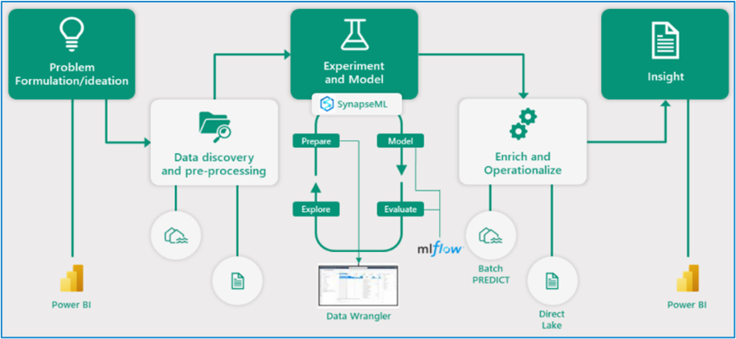

### Exercise 5: Explorer Data Science experience in Microsoft Fabric (Optional)
 
Microsoft Fabric offers Data Science experiences to empower users to complete end-to-end data science workflows for data enrichment and business insights. You can complete a wide range of activities across the entire data science process, all the way from data exploration, preparation and cleansing to experimentation, modeling, model scoring and serving predictive insights to BI reports.


### Task 5.1: Build ML models and experiments using Copilot in Fabric

   

To understand the cause behind Contoso’s declining revenue, the team needed to dive deeper into their customers’ spending pattern.

Copilot responds to queries in natural language or generates customized code snippets for tasks like creating charts, filtering data, applying transformations, and building machine learning models.

Let’s see how Copilot for Notebook helps you, as a Data Engineer, quickly create Data Science Notebooks.

1. Click on the **<inject key= "WorkspaceName" enableCopy="true"/>** workspace from the left navigation pane.

   

   >**Note:** Click on **Don't save** if this pop-up appears.

   

2. Click on **Import** dropdown, select **Notebook** and then select **From this computer**

   

   >**Note:** If the Import option is not visible, click the **three dots (ellipsis)** button and select Import.

3. Click on the **Upload** button.

   

4. Browse to the fabricnotebooks folder **"C:\LabFiles\02_lab\artifacts\fabricnotebooks"** in the VM and select **Build ML models and experiments using Copilot for Data Science in Fabric** notebook.

5. Click on the **Open** button.

   

6. Wait for the notebook to **upload**.

   

7. Click on the **<inject key= "WorkspaceName" enableCopy="false"/>** workspace from the left navigation pane.

   

8. Click on **Filter**, expand **Type** and select **Notebook**.

   

9. Click on the **Build ML models and experiments using Copilot for Data Science in Fabric** notebook.

   

10. Click on **+ Add data items** button and click on **Existing data sources**.

      

11. Select **lakehouse**, and click on **Connect** button.

      


12. In the Explorer pane, click on the **ellipsis (three dots)** next to your lakehouse and select **Set as default lakehouse**.

      


13. Click on **Connect** dropdown in the Home Ribbon and click on **New standard session** to connect to a session.

      

14. Click on the **Copilot** button and then click on the **Get Started** button.
 
      >**Note:** If the Copilot is not visible please click on ellipsis (three dots) **...** and select Copilot.

      

15. Copy and paste the following **prompt** in the textbox.

      ```
      Load the "customerchurndata" table from the lakehouse into a Spark DataFrame. Then convert that into pandas dataframe as df
      ```

16. Click on the **send** button.

      

17. Click on the **Copy code** icon.

      >**Note:** The new cell will be created right above the cell.

      

18. Hover above the first cell and then click on a **+ Code** icon.

      >**Note:** The new cell will be created right above the existing cell.

      

19. Paste the copied **query** and run the new **cell**.

      

      >**Note:** Copilot may not respond as expected, please copy and paste the following code if the code execution fails:

      ```
      # Load the table into a Spark DataFrame
      spark_df = spark.table('lakehouse.customerchurndata')
 
      # Convert the Spark DataFrame to a pandas DataFrame
      df = spark_df.toPandas()
      ```

      >**Note:** It may take some time for the copilot to generate query.

With the data prepared with the help of Copilot, Data Scientists like you can explore the data to understand the patterns it contains.

The rest of the notebook has similar PySpark queries to explore customer churn prediction.


### Task 5.2: Leverage AI skills

AI Skill, a new capability in Fabric, allows Data Analysts like Serena to create their own generative AI experiences. Serena believes that generative AI offers a transformative way to interact with data, significantly boosting data-driven decision-making in organizations worldwide. 

In this exercise, you’ll step into Data Analyst, Serena’s shoes and leverage AI Skill to create conversational question-and-answer (Q&A) systems. 

1. Click on the **<inject key= "WorkspaceName" enableCopy="true"/>** workspace from the left navigation pane.

   

2. Click on **New item** and search for **Data agent**. select **Data agent(Preview)**.

   

3. In the **Create data agent** pop-up: Enter **Contoso-assistant** in the name field and click on **Create** button.

   ```BASH
   Contoso-assistant
   ```

   

4. In the Explorer pane, click on **+ Data source**.

   

5. Select **Lakehouse** from the available options, and then click **Add** to include it as a data source.

   

6. Click on **Refresh** button.

   

7. Under lakehouse dropdown, expand **dbo**, and select the following tables as shown in the screenshot.

   - dimcustomer
   - dimdate
   - dimproduct
   - dimreseller
   - factinternetsales
   - factresellersales

      

   >**Note:** If the tables are not visible, hard refresh the VM browser using **Ctrl + Shft + R**.

8. In the chatbox, type **What is the most sold product?** and click the **Send** icon to submit your query. Once the answer appears, expand the response by clicking the **1 step completed** dropdown icon beneath it to view the underlying SQL query result.

   ```BASH
   What is the most sold product?
   ```
   

   >**Note:** This may take some time; wait until a response is received.

9. Data agent answered the question fairly well based on the selected tables.

   However, the SQL query needs some improvement, it orders the products by order quantity, when total sales revenue associated with the product is the most important consideration, as shown in the above screenshot.

   To improve the query generation, let's provide some instructions, as shown in these examples:

   ```
   Whenever I ask about "the most sold" products or items, the metric of interest is total sales revenue and not order quantity.

   The primary table to use is FactInternetSales. Only use FactResellerSales if explicitly asked about resales or when asked about total sales.
   ```

10. Copy the above notes and click on the **AI Instructions** paste it in **AI instruction** input box. 
11. Type **What is the most sold product?** in the chatbox and then click on the **Send** button.  

      ```BASH
      What is the most sold product?
      ```

Asking the question again returns a different answer, **Mountain-200 Black, 46**, as shown in the below screenshot:


In addition to instructions, examples serve as another effective way to guide the AI. If you have questions that your AI skill often receives, or questions that require complex joins.

12. Click on the **Example queries** In the Example queries click on **edit** icon.

      

13. Click on **+ Add Example**, enter the provided question along with its corresponding SQL query, and then click the **Close (X)** button.

      

|Question| SQL query|
|--------|----------|
|who are the top 5 customers by total sales amount?|SELECT TOP 5 CONCAT(dc.FirstName, ' ', dc.LastName) AS CustomerName, SUM(fis.SalesAmount) AS TotalSpent FROM factinternetsales fis JOIN dimcustomer dc ON fis.CustomerKey = dc.CustomerKey GROUP BY CONCAT(dc.FirstName, ' ', dc.LastName) ORDER BY TotalSpent DESC;|

>**Note** : After entering the first example and query, click the **+ Add Example** button.


14. Type **who are the top 5 customers by total sales amount?** in the chatbox and click on **Send** button.

      ```BASH
      who are the top 5 customers by total sales amount?
      ```

      

15. Click on **Publish**.

      

16. In the pop-up screen click on the **Publish** button.

      

17. Notice that AI skill is published successfully.

      
